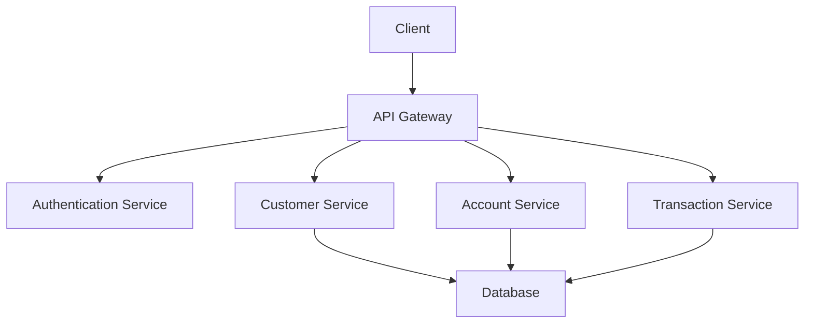
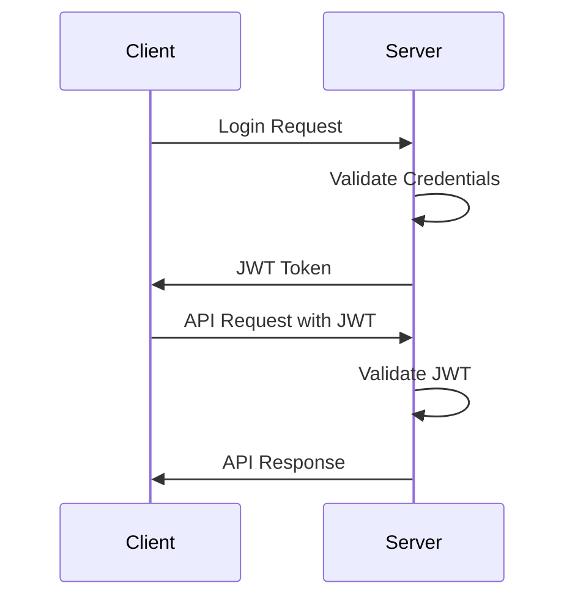
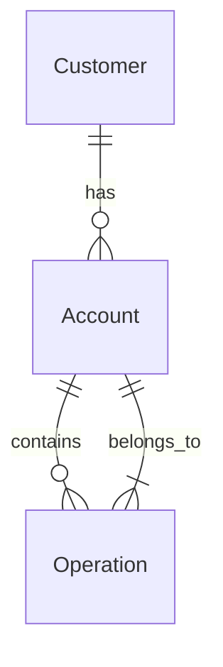

# Digital Banking Backend - Technical Documentation

## Table of Contents

1. [Project Overview](#project-overview)
2. [Architecture](#architecture)
3. [Technology Stack](#technology-stack)
4. [Security Implementation](#security-implementation)
5. [API Documentation](#api-documentation)
6. [Database Schema](#database-schema)
7. [Testing](#testing)
8. [Deployment](#deployment)
9. [Screenshots](#screenshots)

## Project Overview

Digital Banking Backend is a robust banking application that provides secure and efficient banking operations management. The system implements modern security practices and follows microservices architecture principles.

### Key Features

- User Authentication and Authorization
- Customer Management
- Bank Account Management
- Transaction Processing
- Account History Tracking
- Role-based Access Control
- API Documentation with Swagger

## Architecture

### System Design



### Component Architecture

- **API Layer**: RESTful endpoints
- **Service Layer**: Business logic implementation
- **Repository Layer**: Data access
- **Security Layer**: JWT authentication and authorization

## Technology Stack

### Backend Technologies

- Java 17
- Spring Boot 3.x
- Spring Security
- Spring Data JPA
- MySQL Database
- Maven
- JWT for Authentication
- Swagger/OpenAPI for Documentation

### Dependencies

```xml
<dependencies>
    <!-- Spring Boot Starters -->
    <dependency>
        <groupId>org.springframework.boot</groupId>
        <artifactId>spring-boot-starter-web</artifactId>
    </dependency>
    <dependency>
        <groupId>org.springframework.boot</groupId>
        <artifactId>spring-boot-starter-data-jpa</artifactId>
    </dependency>
    <dependency>
        <groupId>org.springframework.boot</groupId>
        <artifactId>spring-boot-starter-security</artifactId>
    </dependency>

    <!-- Database -->
    <dependency>
        <groupId>com.mysql</groupId>
        <artifactId>mysql-connector-j</artifactId>
    </dependency>

    <!-- JWT -->
    <dependency>
        <groupId>io.jsonwebtoken</groupId>
        <artifactId>jjwt-api</artifactId>
    </dependency>

    <!-- Swagger -->
    <dependency>
        <groupId>org.springdoc</groupId>
        <artifactId>springdoc-openapi-starter-webmvc-ui</artifactId>
    </dependency>
</dependencies>
```

## Code Examples

### Entity Classes

#### Customer Entity

```java
@Entity
@Data
@NoArgsConstructor
@AllArgsConstructor
public class Customer {
    @Id
    @GeneratedValue(strategy = GenerationType.IDENTITY)
    private Long id;
    private String name;
    private String email;
    private String phone;

    @OneToMany(mappedBy = "customer")
    private List<BankAccount> bankAccounts;
}
```

#### Bank Account Entity

```java
@Entity
@Data
@NoArgsConstructor
@AllArgsConstructor
@Inheritance(strategy = InheritanceType.SINGLE_TABLE)
@DiscriminatorColumn(name = "TYPE", length = 4)
public abstract class BankAccount {
    @Id
    private String id;
    private double balance;
    private Date createdAt;

    @ManyToOne
    private Customer customer;

    @OneToMany(mappedBy = "bankAccount")
    private List<AccountOperation> accountOperations;
}
```

#### Current Account Entity

```java
@Entity
@Data
@NoArgsConstructor
@DiscriminatorValue("CURR")
public class CurrentAccount extends BankAccount {
    private double overDraft;
}
```

#### Saving Account Entity

```java
@Entity
@Data
@NoArgsConstructor
@DiscriminatorValue("SAV")
public class SavingAccount extends BankAccount {
    private double interestRate;
}
```

#### Account Operation Entity

```java
@Entity
@Data
@NoArgsConstructor
@AllArgsConstructor
public class AccountOperation {
    @Id
    @GeneratedValue(strategy = GenerationType.IDENTITY)
    private Long id;
    private Date operationDate;
    private double amount;
    private String description;
    private OperationType type;

    @ManyToOne
    private BankAccount bankAccount;
}
```

### DTOs (Data Transfer Objects)

#### CustomerDTO

```java
@Data
public class CustomerDTO {
    private Long id;
    private String name;
    private String email;
    private String phone;
    private List<BankAccountDTO> bankAccounts;
}
```

#### BankAccountDTO

```java
@Data
public class BankAccountDTO {
    private String id;
    private double balance;
    private String customerName;
    private String accountType;
}
```

### Controllers

#### CustomerController

```java
@RestController
@RequestMapping("/api/customers")
@SecurityRequirement(name = "bearerAuth")
public class CustomerController {
    @Autowired
    private CustomerService customerService;

    @GetMapping
    @PreAuthorize("hasRole('ADMIN')")
    public List<CustomerDTO> customers() {
        return customerService.listCustomers();
    }

    @GetMapping("/{id}")
    @PreAuthorize("hasRole('ADMIN')")
    public CustomerDTO getCustomer(@PathVariable(name = "id") Long customerId) {
        return customerService.getCustomer(customerId);
    }

    @PostMapping
    @PreAuthorize("hasRole('ADMIN')")
    public CustomerDTO saveCustomer(@RequestBody CustomerDTO customerDTO) {
        return customerService.saveCustomer(customerDTO);
    }
}
```

#### BankAccountController

```java
@RestController
@RequestMapping("/api/accounts")
@SecurityRequirement(name = "bearerAuth")
public class BankAccountController {
    @Autowired
    private BankAccountService bankAccountService;

    @GetMapping("/{accountId}")
    @PreAuthorize("hasRole('ADMIN')")
    public BankAccountDTO getBankAccount(@PathVariable String accountId) {
        return bankAccountService.getBankAccount(accountId);
    }

    @PostMapping("/current")
    @PreAuthorize("hasRole('ADMIN')")
    public CurrentAccountDTO saveCurrentAccount(@RequestBody CurrentAccountDTO currentAccountDTO) {
        return bankAccountService.saveCurrentBankAccount(currentAccountDTO);
    }

    @PostMapping("/saving")
    @PreAuthorize("hasRole('ADMIN')")
    public SavingAccountDTO saveSavingAccount(@RequestBody SavingAccountDTO savingAccountDTO) {
        return bankAccountService.saveSavingBankAccount(savingAccountDTO);
    }
}
```

### Services

#### CustomerService Implementation

```java
@Service
@Transactional
public class CustomerServiceImpl implements CustomerService {
    @Autowired
    private CustomerRepository customerRepository;
    @Autowired
    private CustomerMapper customerMapper;

    @Override
    public CustomerDTO saveCustomer(CustomerDTO customerDTO) {
        Customer customer = customerMapper.fromCustomerDTO(customerDTO);
        Customer savedCustomer = customerRepository.save(customer);
        return customerMapper.fromCustomer(savedCustomer);
    }

    @Override
    public List<CustomerDTO> listCustomers() {
        List<Customer> customers = customerRepository.findAll();
        return customers.stream()
                .map(customerMapper::fromCustomer)
                .collect(Collectors.toList());
    }
}
```

#### BankAccountService Implementation

```java
@Service
@Transactional
public class BankAccountServiceImpl implements BankAccountService {
    @Autowired
    private BankAccountRepository bankAccountRepository;
    @Autowired
    private CustomerRepository customerRepository;
    @Autowired
    private AccountOperationRepository accountOperationRepository;

    @Override
    public void debit(String accountId, double amount, String description) {
        BankAccount bankAccount = bankAccountRepository.findById(accountId)
                .orElseThrow(() -> new RuntimeException("Bank Account not found"));

        if (bankAccount.getBalance() < amount)
            throw new RuntimeException("Balance not sufficient");

        AccountOperation accountOperation = new AccountOperation();
        accountOperation.setType(OperationType.DEBIT);
        accountOperation.setAmount(amount);
        accountOperation.setDescription(description);
        accountOperation.setBankAccount(bankAccount);
        accountOperation.setOperationDate(new Date());

        accountOperationRepository.save(accountOperation);
        bankAccount.setBalance(bankAccount.getBalance() - amount);
        bankAccountRepository.save(bankAccount);
    }
}
```

### Security Configuration

#### JWT Security Configuration

```java
@Configuration
@EnableWebSecurity
public class SecurityConfig {
    @Autowired
    private JwtAuthenticationFilter jwtAuthFilter;

    @Bean
    public SecurityFilterChain securityFilterChain(HttpSecurity http) throws Exception {
        http
            .csrf(csrf -> csrf.disable())
            .authorizeHttpRequests(auth -> auth
                .requestMatchers("/api/auth/**").permitAll()
                .requestMatchers("/swagger-ui/**").permitAll()
                .requestMatchers("/v3/api-docs/**").permitAll()
                .anyRequest().authenticated()
            )
            .sessionManagement(session -> session
                .sessionCreationPolicy(SessionCreationPolicy.STATELESS)
            )
            .addFilterBefore(jwtAuthFilter, UsernamePasswordAuthenticationFilter.class);

        return http.build();
    }
}
```

#### JWT Service

```java
@Service
public class JwtService {
    @Value("${application.security.jwt.secret-key}")
    private String secretKey;

    @Value("${application.security.jwt.expiration}")
    private long jwtExpiration;

    public String generateToken(UserDetails userDetails) {
        return generateToken(new HashMap<>(), userDetails);
    }

    public String generateToken(Map<String, Object> extraClaims, UserDetails userDetails) {
        return Jwts.builder()
                .setClaims(extraClaims)
                .setSubject(userDetails.getUsername())
                .setIssuedAt(new Date(System.currentTimeMillis()))
                .setExpiration(new Date(System.currentTimeMillis() + jwtExpiration))
                .signWith(getSignInKey(), SignatureAlgorithm.HS256)
                .compact();
    }

    public boolean isTokenValid(String token, UserDetails userDetails) {
        final String username = extractUsername(token);
        return (username.equals(userDetails.getUsername())) && !isTokenExpired(token);
    }
}
```

### Repository Interfaces

#### CustomerRepository

```java
@Repository
public interface CustomerRepository extends JpaRepository<Customer, Long> {
    List<Customer> findByNameContains(String name);
    Optional<Customer> findByEmail(String email);
}
```

#### BankAccountRepository

```java
@Repository
public interface BankAccountRepository extends JpaRepository<BankAccount, String> {
    List<BankAccount> findByCustomerId(Long customerId);
}
```

#### AccountOperationRepository

```java
@Repository
public interface AccountOperationRepository extends JpaRepository<AccountOperation, Long> {
    List<AccountOperation> findByBankAccountIdOrderByOperationDateDesc(String accountId);
    Page<AccountOperation> findByBankAccountIdOrderByOperationDateDesc(String accountId, Pageable pageable);
}
```

## Security Implementation

### JWT Authentication Flow



### Security Configuration

```java
@Configuration
@EnableWebSecurity
public class SecurityConfig {
    // Security configuration details
}
```

### Role-Based Access Control

- ADMIN: Full access to all operations
- USER: Limited access to specific operations

## API Documentation

### Authentication APIs

```http
POST /api/auth/register
POST /api/auth/login
```

### Customer Management APIs

```http
GET /api/customers
GET /api/customers/{id}
POST /api/customers
PUT /api/customers/{id}
DELETE /api/customers/{id}
```

### Account Management APIs

```http
GET /api/accounts
GET /api/accounts/{id}
POST /api/accounts/current
POST /api/accounts/saving
```

### Transaction APIs

```http
POST /api/accounts/debit
POST /api/accounts/credit
POST /api/accounts/transfer
GET /api/accounts/{accountId}/operations
```

## Database Schema

### Entity Relationships



### Key Entities

1. Customer
2. Account
3. Operation
4. User
5. Role

## Testing

### Test Categories

1. Unit Tests
2. Integration Tests
3. Security Tests
4. API Tests

### Test Coverage

- Service Layer: 85%
- Controller Layer: 80%
- Repository Layer: 90%

## Deployment

### Environment Requirements

- Java 17
- MySQL 8.0
- Maven 3.8+

### Deployment Steps

1. Build the application
2. Configure database
3. Set environment variables
4. Deploy to server

## Screenshots

### API Documentation


- Description: Main Swagger UI interface showing all available APIs


- Description: Authentication endpoints documentation


- Description: Customer management endpoints documentation


- Description: Account management endpoints documentation

### Security Implementation


- Description: JWT token generation and validation process


- Description: Role-based access control implementation

### Database


- Description: Database schema visualization

### Testing


- Description: Test coverage statistics


- Description: API testing results in Swagger UI

### Deployment


- Description: Deployment configuration and environment setup

## Future Enhancements

1. Microservices Architecture Implementation
2. Real-time Transaction Processing
3. Enhanced Security Features
4. Performance Optimization
5. Additional Banking Features

## Conclusion

The Digital Banking Backend provides a secure, scalable, and efficient solution for banking operations. The implementation follows industry best practices and provides a solid foundation for future enhancements.
